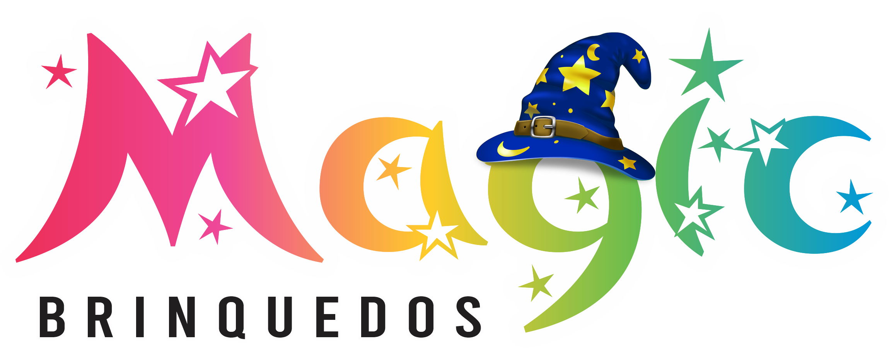

# 🎁 Magic Brinquedos - Landing Page

<div align="center">
  
  
  ### ✨ Aqui a brincadeira é mágica! ✨
  
  Uma landing page moderna e responsiva para a loja de brinquedos Magic Brinquedos, criada com React e Material-UI.
</div>

---

## 📋 Sobre o Projeto

A **Magic Brinquedos** é uma loja de brinquedos local que oferece produtos de qualidade para transformar sonhos em realidade. Esta landing page foi desenvolvida para apresentar a loja, seus produtos e criar uma conexão direta com os clientes através de uma experiência digital moderna e envolvente.

### 🎯 Objetivo

Criar uma presença digital forte para a Magic Brinquedos, facilitando o contato com clientes e apresentando os produtos de forma atrativa e profissional.

---

## ✨ Funcionalidades

### 🏠 **Seções da Landing Page**

- **Hero Section**: Apresentação impactante com call-to-action
- **Estatísticas**: Números da loja (clientes satisfeitos, produtos, etc.)
- **Produtos em Destaque**: Showcase dos principais brinquedos
- **Categorias**: Diferentes tipos de brinquedos disponíveis
- **Depoimentos**: Feedback dos clientes satisfeitos
- **Feed do Instagram**: Integração com rede social
- **Localização**: Informações de contato e endereço

### 📱 **Recursos Técnicos**

- ✅ **Design Responsivo**: Funciona perfeitamente em mobile, tablet e desktop
- ✅ **Animações Suaves**: Transições elegantes com Framer Motion
- ✅ **WhatsApp Integrado**: Botão flutuante para contato direto
- ✅ **Navegação Smooth**: Rolagem suave entre seções
- ✅ **SEO Otimizado**: Meta tags e estrutura otimizada para buscadores
- ✅ **Performance**: Carregamento rápido e otimizado

---

## 🛠️ Tecnologias Utilizadas

### **Frontend**

- ⚛️ **React 19** - Biblioteca principal
- 🎨 **Material-UI (MUI) v7** - Componentes e design system
- 🎭 **Framer Motion** - Animações e transições
- 🎯 **React Router Dom** - Navegação

### **Estilização**

- 💄 **Emotion** - CSS-in-JS para estilização
- 🎨 **Tema Customizado** - Cores baseadas na identidade visual da marca

### **Ferramentas de Desenvolvimento**

- ⚡ **Vite** - Build tool moderna e rápida
- 📝 **ESLint** - Linting e qualidade do código
- 🔧 **SWC** - Compilador rápido para React

---

## 🚀 Como Executar o Projeto

### **Pré-requisitos**

- Node.js (versão 16 ou superior)
- npm ou yarn

### **Instalação**

1. **Clone o repositório**

```bash
git clone https://github.com/seu-usuario/lading-page-magic-brinquedos.git
cd lading-page-magic-brinquedos
```

2. **Instale as dependências**

```bash
npm install
# ou
yarn install
```

3. **Execute o projeto em modo de desenvolvimento**

```bash
npm run dev
# ou
yarn dev
```

4. **Acesse no navegador**

```
http://localhost:5173
```

### **Comandos Disponíveis**

```bash
# Desenvolvimento
npm run dev          # Inicia o servidor de desenvolvimento

# Produção
npm run build        # Cria build de produção
npm run preview      # Visualiza o build de produção

# Qualidade de Código
npm run lint         # Executa o linting do código
```

---

## 📁 Estrutura do Projeto

```
src/
├── components/           # Componentes reutilizáveis
│   ├── Categories.jsx    # Seção de categorias
│   ├── FeaturedProducts.jsx # Produtos em destaque
│   ├── FloatingWhatsApp.jsx # Botão WhatsApp flutuante
│   ├── Footer.jsx        # Rodapé
│   ├── HeroSection.jsx   # Seção principal
│   ├── InstagramFeed.jsx # Feed do Instagram
│   ├── LoadingSpinner.jsx # Componente de loading
│   ├── Location.jsx      # Informações de localização
│   ├── MagicParticles.jsx # Efeitos visuais
│   ├── Navigation.jsx    # Barra de navegação
│   ├── Stats.jsx         # Estatísticas da loja
│   └── Testimonials.jsx  # Depoimentos
├── theme/
│   └── index.js          # Configuração do tema MUI
├── App.jsx               # Componente principal
├── main.jsx              # Ponto de entrada
└── index.css             # Estilos globais

public/
└── assets/               # Imagens e recursos estáticos
    ├── favicon.png
    ├── LOGO_MAGIC_BRINQUEDOS.png
    └── [outros assets...]
```

---

## 🎨 Design e Identidade Visual

### **Paleta de Cores**

- 🌸 **Rosa Principal**: `#FF6B9D` - Cor principal da marca
- 🧡 **Laranja**: `#FFA726` - Cor secundária
- 💚 **Verde WhatsApp**: `#25D366` - Botões de contato
- 🔵 **Azul**: `#2196F3` - Elementos de destaque

### **Tipografia**

- **Fonte Principal**: Lexend Deca - Fonte moderna e legível

### **Componentes Customizados**

- Botões com gradientes
- Cards com sombras elegantes
- Navegação com efeitos de scroll
- Animações suaves e profissionais

---

## 📱 Responsividade

O projeto foi desenvolvido com **mobile-first** em mente:

- 📱 **Mobile**: < 600px
- 📟 **Tablet**: 600px - 960px
- 💻 **Desktop**: > 960px

Todos os componentes se adaptam automaticamente ao tamanho da tela.

---

## 🔗 Integração WhatsApp

O site possui integração direta com WhatsApp através de:

- Botão flutuante no canto da tela
- Botão na navegação
- Mensagem pré-configurada para facilitar o contato

**Número configurado**: `+55 11 91596-2801`

---

## 🔧 Customização

### **Alterando Informações da Loja**

1. **Número WhatsApp**: Edite em `src/components/Navigation.jsx` linha 46
2. **Informações de contato**: Edite em `src/components/Location.jsx`
3. **Produtos**: Atualize em `src/components/FeaturedProducts.jsx`

### **Modificando Cores**

Edite o arquivo `src/theme/index.js` para alterar a paleta de cores.

### **Adicionando Novas Seções**

1. Crie o componente em `src/components/`
2. Importe e adicione em `src/App.jsx`
3. Adicione link na navegação se necessário

---

## 🤝 Contribuição

Contribuições são bem-vindas! Sinta-se à vontade para:

1. Fazer fork do projeto
2. Criar uma branch para sua feature (`git checkout -b feature/nova-feature`)
3. Commit suas alterações (`git commit -m 'Adiciona nova feature'`)
4. Push para a branch (`git push origin feature/nova-feature`)
5. Abrir um Pull Request

---

## 📄 Licença

Este projeto foi desenvolvido especificamente para a **Magic Brinquedos**.

---

## 📞 Contato

**Magic Brinquedos**

- 📱 WhatsApp: [+55 11 91596-2801](https://wa.me/5511915962801)
- 🌐 Website: Em breve!
- 📧 Email: Disponível via WhatsApp

---

<div align="center">
  
### 🎁 Desenvolvido com ❤️ para a Magic Brinquedos

_Aqui a brincadeira é mágica!_ ✨

</div>
